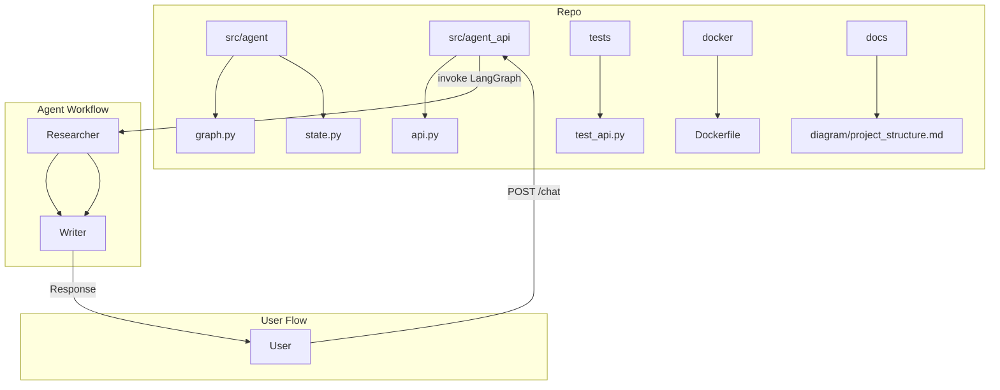

```mermaid
graph TD
    subgraph Repo
        A[src/agent] --> B[graph.py]
        A --> C[state.py]
        D[src/agent_api] --> E[api.py]
        F[tests] --> G[test_api.py]
        H[docker] --> I[Dockerfile]
        J[docs] --> K[diagram/project_structure.md]
    end

    subgraph Agent Workflow
        R[Researcher] --> W[Writer]
    end

    subgraph User Flow
        U[User] -->|POST /chat| D
        D -->|invoke LangGraph| R
        R --> W
        W -->|Response| U
    end
```
